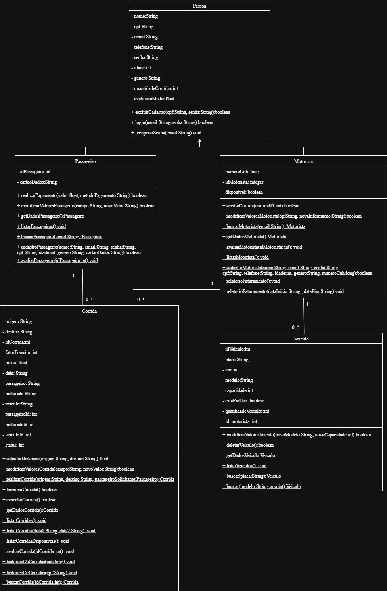

# 🚗 Sistema de Aplicativo de Transporte

## 📌 Introdução

Este projeto tem como objetivo simular um sistema de aplicativo de transporte similar a aplicativos como Uber. Desenvolvido como parte de um projeto acadêmico da disciplina Programação Orientada a Objetos, o sistema permite o controle de usuários (motoristas e passageiros), cadastro e gerenciamento de corridas, histórico, avaliações e mais.


## ⚙️ Funcionalidades

## 🧑‍💼 Cadastro e Autenticação
- Permite login e cadastro de passageiros e motoristas
- Armazena e gerencia informações pessoais (nome, CPF, e-mail, telefone, etc.)
- Edição e visualização de perfil dos usuários

## 🚘 Gerenciamento de Veículos
- Edição e exclusão de veículos vinculados aos motoristas
- Consulta de veículo por placa
- Listagem completa de todos os veículos cadastrados

## 🧾 Gerenciamento de Corridas
- Solicitação de corrida por passageiros com origem, destino e forma de pagamento
- Aceitação de corrida pelos motoristas
- Conclusão de corrida e cálculo automático de distância e valor
- Avaliação do motorista após a corrida
- Consulta de histórico de corridas por usuário
- Listagem de todas as corridas
- Listagem de corridas em andamento
- Busca de corrida por ID

## 📊 Relatórios e Histórico
- Histórico de corridas por passageiro e motorista
- Listagem geral de corridas no sistema
- Visualização de informações detalhadas da corrida (motorista, passageiro, horários, valor, status)
- Relatório de corridas filtradas por período

## 🔐 Controle de Acesso
- Login seguro com validação de CPF e senha
- Áreas distintas para passageiro e motorista após autenticação
- Validação de ações com base no tipo de usuário logado  

## 🧠 Diagrama de Classes




## 🛠️ Tecnologias e Ferramentas Utilizadas

- **Linguagem de Programação:** Java 17+
- **Banco de Dados:** PostgreSQL
- **Hospedagem do Banco:** Amazon RDS (AWS)
- **IDE recomendada:** Visual Studio Code
- **Gerenciamento de Dependências:** JDBC puro (sem frameworks ORM)
- **Organização do Projeto:** padrão DAO (Data Access Object)


## ▶️ Como Executar o Projeto

### 🔧 Pré-requisitos

- JDK instalado (Java 17 ou superior)
- PostgreSQL configurado e acessível
- IDE de sua escolha (Eclipse, IntelliJ, VS Code com extensões Java)

### 📥 Passos para execução

1. **Clone o repositório**

```bash
git clone https://github.com/M-Aparecida/projeto_POO.git
cd projeto_POO
```
2. **Crie o banco de dados com o nome `transporte`**

Execute o script SQL com a estrutura do banco de dados (banco.sql) no seu PostgreSQL.

3. **Configure a conexão com o banco de dados**

Crie um arquivo database.properties, configure as credenciais conforme seu ambiente:

```
db.url=jdbc:postgresql://localhost:5432/transporte
db.user= <seu user>
db.pswd= <sua senha>
```

4. **Compile e execute o projeto na IDE**

Rode a classe App.java para iniciar a aplicação via menu.


## 🤝 Colaboradores
<table align="center">
  <tr>    
    <td align="center">
      <a href="https://github.com/Difierro">
        <br>
        Gustavo Rodrigues
      </a>
    </td>
    <td align="center">
      <a href="https://github.com/Jessicaisabela">
        <br>
        Jéssica Isabela
      </a>
    </td>
    <td align="center">
      <a href="https://github.com/M-Aparecida">
        <br>
        Maria Aparecida
      </a>
    </td>
    <td align="center">
      <a href="https://github.com/euduar-da">
        <br>
        Maria Eduarda
      </a>
    </td>
  </tr>
</table>
